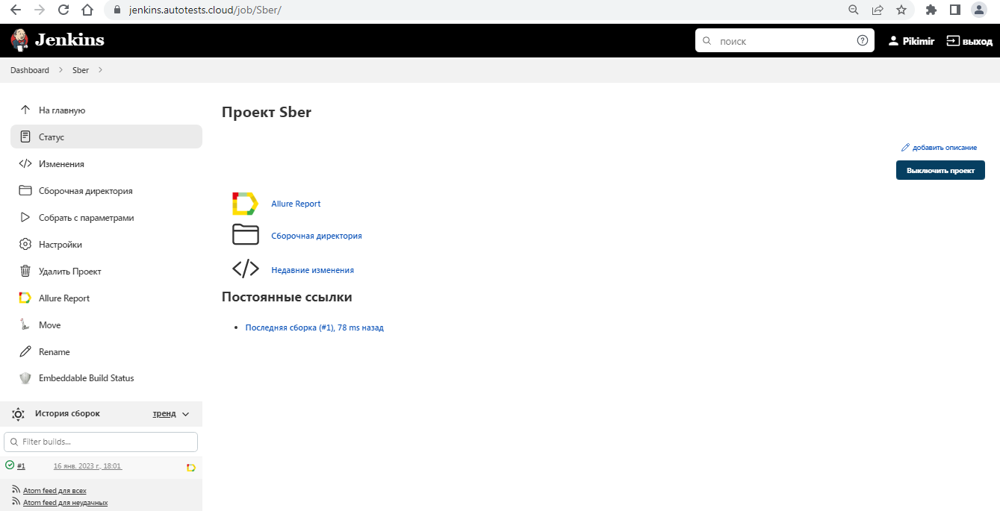
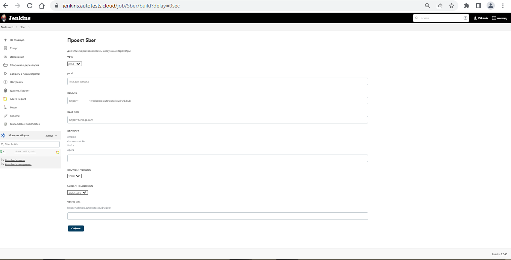
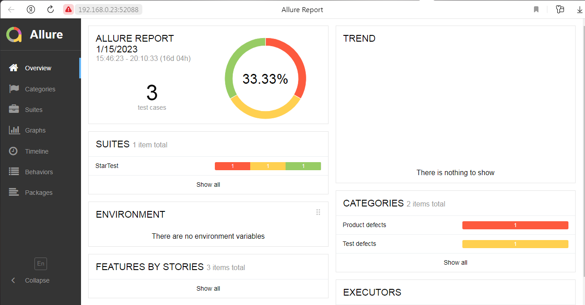
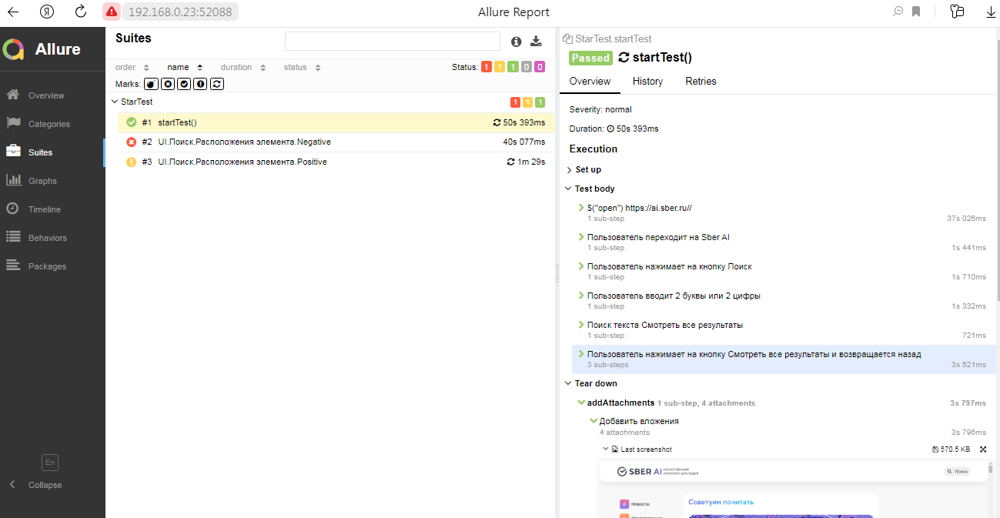
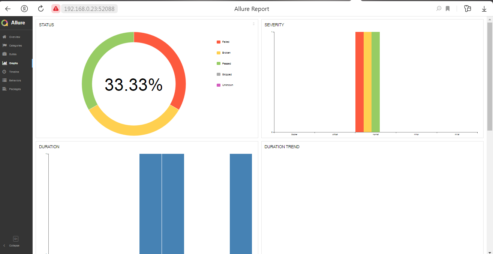

# Проект по автоматизации тестирования web приложения Saucedemo

## 	Содержание

> ➠ [Покрытый функционал](#покрытый-функционал)
>
> ➠ [Технологический стек](#технологический-стек)
>
> ➠ [Запуск тестов из терминала](#запуск-тестов-из-терминала)
>
> ➠ [Запуск тестов в Jenkins](#-удаленный-запуск-тестов-в-Jenkins)
>
> ➠ [Отчет о результатах тестирования в Allure Report](#-главная-страница-allure-отчета)
>
> ➠ [Уведомления в Telegram с использованием бота](#-уведомления-в-telegram-с-использованием-бота)
>
> ➠ [Пример запуска теста в Selenoid](#-пример-запуска-теста-в-selenoid)

##  Покрытый функционал

> Разработаны автотесты на <code>UI</code>.
### UI

- [x] Авторизация в веб приложении
- [x] Проверка сортировки товаров
- [x] Добавление товаров в корзину
- [x] Оформление и оплата заказа

## Технологический стек

<p align="center">


</p>

### В данном проекте автотесты написаны на <code>Java</code> с использованием <code>Selenide</code> для UI-тестов.
>
> <code>Selenoid</code> выполняет запуск браузеров в контейнерах <code>Docker</code>.
>
> <code>Allure Report</code> формирует отчет о запуске тестов.
>
> Для автоматизированной сборки проекта используется <code>Gradle</code>.
>
> В качестве библиотеки для модульного тестирования используется <code>JUnit 5</code>.
>
> <code>Jenkins</code> выполняет запуск тестов.
>
> После завершения прогона отправляются уведомления с помощью бота в <code>Telegram</code>.

## Запуск тестов из терминала

### Локальный запуск тестов

#### Локальный запуск тестов с использованием параметров из property файла

```
gradle clean test -Denv={имя property файла в test.resources}
```

#### Локальный запуск тестов с использованием параметров из property файла test

```
gradle clean test
```

#### Описание параметров для запуска тестов

> -DbrowserName <code>название браузера</code>
>
> -DbrowserVersion <code>версия браузера</code>
>
> -DbaseUrl <code>url стенда фронта</code>
>
> -DbrowserSize <code>разрешение браузера</code>
>
> -DpageLoadTimeout <code>таймоут загрузки страницы</code>
>
> -Dtimeout <code>таймаут ожидания загрузки элемента страницы</code>
>
> -Dheadless <code>запуск браузера в обычном или headless режиме</code>
>
> -DisRemote <code>запуск тестов локально или через remote сервис</code>
>
> -DremoteUrl <code>url remote сервиса</code>

### Удаленный запуск тестов

#### Удалённый запуск через передачу параметров

<code>gradle clean test -DisRemote=true -DremoteUrl={url}</code>

#### Удалённый запуск через заранее подготовленный property файл

> Создаём property файл с необходимыми параметрами и кладём его в <code>test.resources</code>
>
> Запускаем тесты, используя созданный property файл
>
> <code>gradle clean test -Denv={имя файла}</code>

##### Пример файла
```
browserName=chrome
browserVersion=108
baseUrl=https://www.google.com
browserSize=1920x1080
pageLoadTimeout=10000
timeout=10000
headless=false
isRemote=true
remoteUrl=https://selenoid.autotests.cloud
```

##  Удаленный запуск тестов в Jenkins

> Для запуска тестов используется параметризированная сборка

<p align="center">

</p>

#### 2. Выбрать пункт **Собрать с параметрами**
#### 3. В случае необходимости изменить параметры, выбрав значения из выпадающих списков
#### 4. Нажать **Собрать**
#### 5. Результат запуска сборки можно посмотреть в отчёте Allure

<p align="center">

</p>

##  Главная страница allure отчета

<p align="center">

</p>

###  Группировка тестов по проверяемому функционалу

<p align="center">

</p>

###  Основной дашборд

<p align="center">

</p>

##  Уведомления в Telegram с использованием бота

> После завершения сборки специальный бот, созданный в <code>Telegram</code>, автоматически обрабатывает и отправляет сообщение с отчетом о прогоне.
>
> Информация по настройке и использованию бота <code>https://github.com/qa-guru/allure-notifications</code>

<p align="center">

</p>

##  Пример запуска теста в Selenoid

> К каждому тесту в отчете прилагается видео. Одно из таких видео представлено ниже.

<p align="center">

</p>
